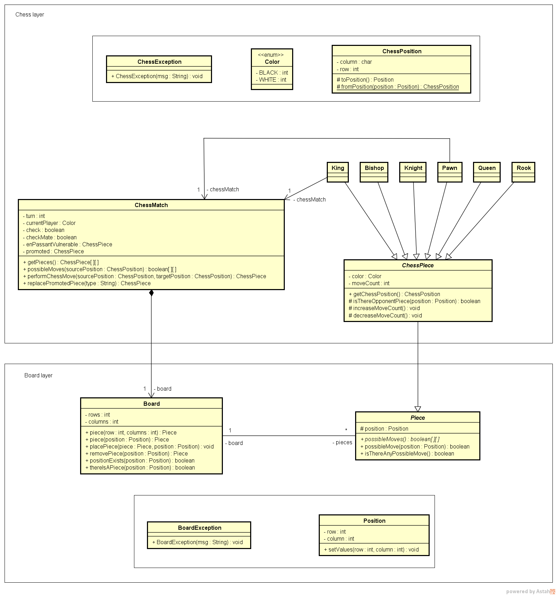

# sistema-jogo-de-xadrez

<h3>Sistema de Jogo de Xadrez feito em Java</h3>
 

<h3>Objetivo geral:</h3>
 

Este estudo de caso tem como objetivo criar um jogo de xadrez feito inteiramente na linguagem Java em modo console.

Será utilizado a seguinte implementação de modelo conceitual para atingirmos o nosso objetivo:

 

 
<h2 align="center">*** EM CONSTRUÇÃO!!! ***</h2>
 