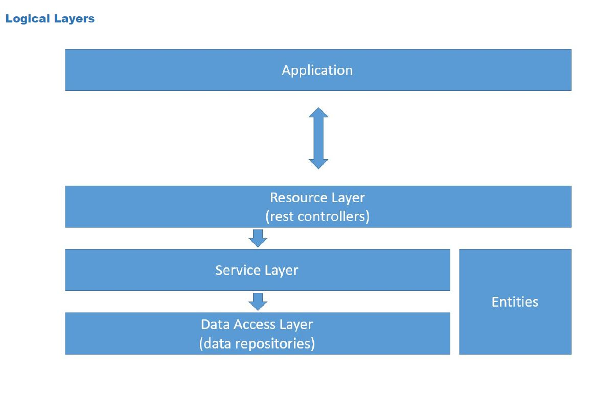

# ecommerceapp-spring-boot

<h2>Aplicativo web de Ecommerce feito com Spring Boot, JPA e Hibernate</h2>
 

<h3>Objetivos:</h3>
 

<ul>
<li> Criar projeto Spring Boot Java</li>
<li> Implementar modelo de domínio</li>
<li> Estruturar camadas lógicas: resource, service, repository</li>
<li> Configurar banco de dados de teste (H2)</li>
<li> Povoar o banco de dados</li>
<li> CRUD - Create, Retrieve, Update, Delete</li>
<li> Tratamento de exceções</li>
</ul>
 

<h3 align="justify">Será utilizado a seguinte implementação de modelo conceitual para atingirmos o nosso objetivo:</h3>
 

  

  

 

 
<h2 align="center">*** EM CONSTRUÇÃO!!! ***</h2>
 
