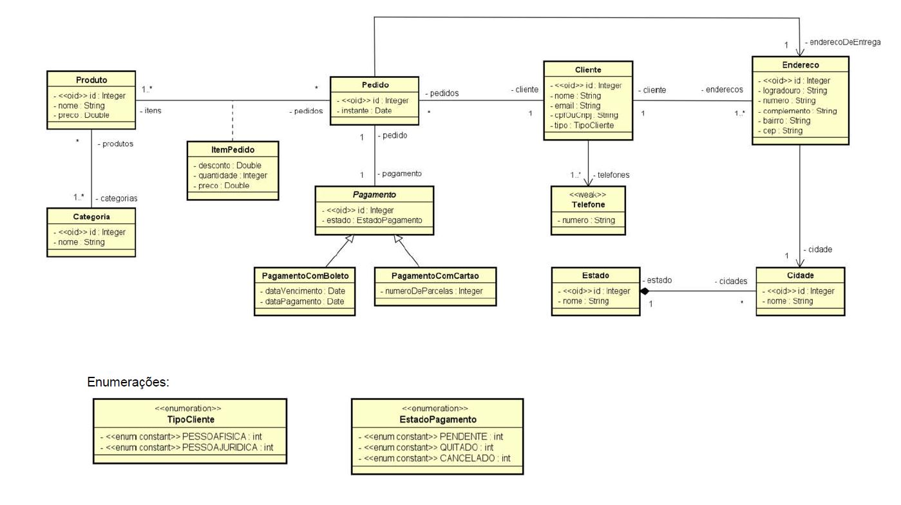
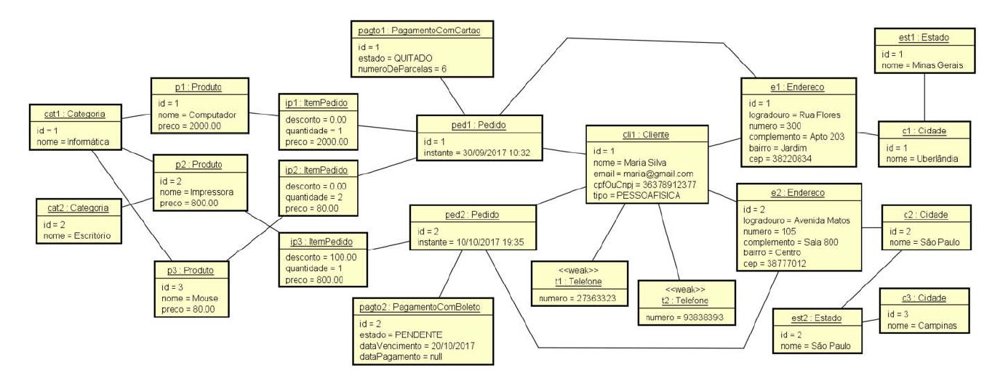

# projeto-carrinho-de-compras

<h3>Projeto Web Back-End Java de carrinho de compras, feito com Java, JPA e Spring Boot aplicando modelagem conceitual UML</h3>
 

<h3>Objetivo geral:</h3>
 

Este estudo de caso tem como objetivo mostrar na prática como um modelo conceitual pode ser implementado
sobre o paradigma orientado a objetos, usando padrões de mercado e boas práticas.

Vamos tomar como caso um modelo conceitual abrangente, com o qual possamos mostrar a implementação prática
em linguagem orientada a objetos dos seguintes tópicos:

<ul>
<li> Leitura e entendimento do diagrama de classes</li>
<li> Leitura e entendimento do diagrama de objetos</li>
<li> Associações</li>
<li> Um para muitos / muitos para um</li>
<li> Um para um</li>
<li> Muitos para muitos</li>
<li> Conceito dependente</li>
<li> Classe de associação</li>
<li> Herança</li>
<li> Enumerações</li>
<li> Tipos primitivos (ItemPedidoPK)</li>
<li> Entidades fracas (ElementCollection)</li>
<li> Associações direcionadas</li>
</ul>

 
<h3>Objetivos específicos:</h3>
 

1) Fazer uma implementação padrão do seguinte modelo conceitual:

 

2) Criar a seguinte instância do modelo conceitual:

 

3) Gerar uma base de dados relacional automaticamente a partir do modelo conceitual, bem como povoar a base com a instância dada.

 

4) Recuperar os dados e disponibilizá-los por meio de uma API Rest BÁSICA. Os seguintes end points devem ser disponibilizados:

<table>
<thead>
<tr><th>End point</th><th>Dados</th></tr>
</thead>
<tbody>
<tr><td>/categorias/{id}</td><td>Categoria e seus produtos</td><tr>
<tr><td>/clientes/{id}</td><td>Cliente, seus telefones e seus endereços</td></tr>
<tr><td>/pedidos/{id}</td><td>Pedido, seu cliente, seu pagamento, seus itens de pedido, seu endereço de entrega</td></tr>
</tbody>
</table>